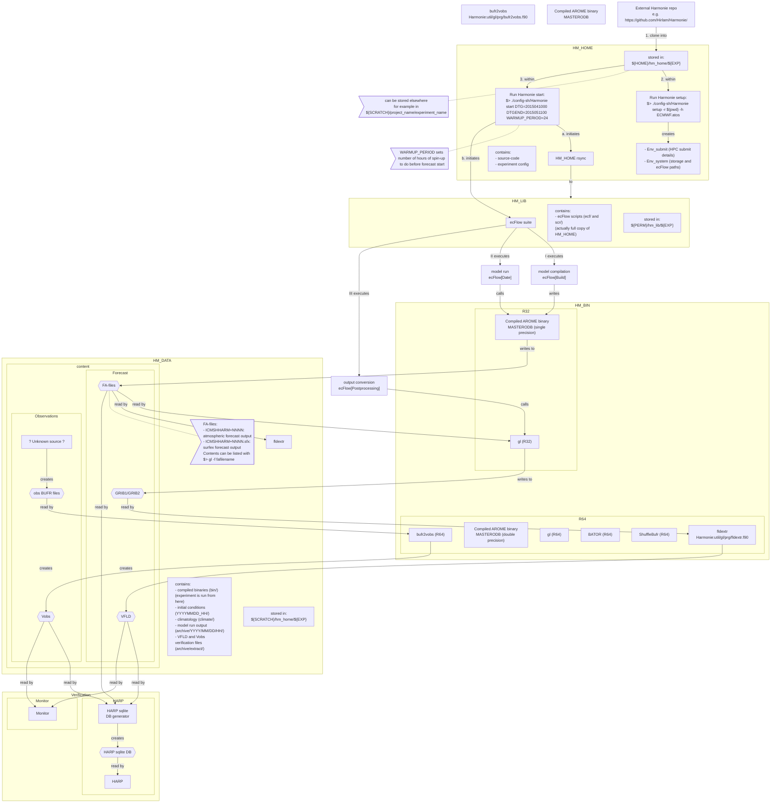

# Harmonie flow-chart

Version v0.1, created 2023-06-27, lcd@dmi.dk

```mermaid
graph TB

%% programs
fldextr_64["fldextr\nHarmonie:util/gl/prg/fldextr.f90"]
HARP
HARPsqliteGenerator["HARP sqlite\nDB generator"]
bufr2vobs["bufr2vobs\nHarmonie:util/gl/prg/bufr2vobs.f90"]
compiledAromeBinary["Compiled AROME binary\nMASTERODB"]
compiledAromeBinary_R32["Compiled AROME binary\nMASTERODB (single precision)"]
gl_R32["gl (R32)"]
compiledAromeBinary_R64["Compiled AROME binary\nMASTERODB (double precision)"]
gl_R64["gl (R64)"]
bator_R64["BATOR (R64)"]
shufflebufr_R64["ShuffleBufr (R64)"]
bufr2vobs_R64["bufr2vobs (R64)"]
Monitor

%% files
GRIB2{{GRIB1/GRIB2}}
obsBUFR{{"obs BUFR files"}}
Vobs{{Vobs}}
VFLD{{VFLD}}
HARPsqliteDB{{HARP sqlite DB}}
FAFiles{{FA-files}}

VFLD -- read by --> HARPsqliteGenerator
Vobs -- read by --> HARPsqliteGenerator


harmonieSetup["Run Harmonie setup:\n$> ./config-sh/Harmonie setup -r $(pwd) -h ECMWF.atos"]
harmonieStart["Run Harmonie start:\n$> ./config-sh/Harmonie start DTG=2015041000 DTGEND=2015051100 WARMUP_PERIOD=24"]

externalHarmonieRepo["External Harmonie repo\ne.g. https://github.com/Hirlam/Harmonie/"]
externalHarmonieRepo -- 1. clone into --> hm_home_location

harmonieSetupOutput["- Env_submit (HPC submit details)\n- Env_system (storage and ecFlow paths)"]

subgraph ecFlowSuite["ecFlow suite"]
end

subgraph HM_HOME
hm_home_location["stored in:\n${HOME}/hm_home/${EXP}"]
hm_home_content["contains:\n- source-code\n- experiment config"]:::leftalign
harmonieSetupOutput

hm_home_location -- 2. within --> harmonieSetup
harmonieSetup -- creates --> harmonieSetupOutput

harmonieStart -- a. initiates --> hmDatahmLibRsync["HM_HOME rsync"]
end

classDef leftalign text-align:left

hm_home_location -.- otherStorage>"can be stored elsewhere\nfor example in\n${SCRATCH}/project_name/experiment_name"]
harmonieStart -.- startWarmupNote>"WARMUP_PERIOD sets number of hours of spin-up to do before forecast start"]

harmonieStart -- b. initiates --> ecFlowSuite

%% ecFlow steps
modelCompilation["model compilation\necFlow[Build]"]
modelRun["model run\necFlow[Date]"]
outputConversion["output conversion\necFlow[Postprocessing]"]

ecFlowSuite -- I executes --> modelCompilation
ecFlowSuite -- II executes --> modelRun
ecFlowSuite -- III executes --> outputConversion

modelRun -- calls --> compiledAromeBinary_R32
modelCompilation -- writes --> compiledAromeBinary_R32
outputConversion -- calls --> gl_R32

%% HM_LIB

subgraph HM_LIB
hm_lib_content["contains:\n- ecFlow scripts (ecf/ and scr/)\n(actually full copy of HM_HOME)"]:::leftalign
hm_lib_location["stored in:\n${PERM}/hm_lib/${EXP}"]

ecFlowSuite
end

compiledAromeBinary_R32 -- writes to --> FAFiles
FAFiles -- read by --> gl_R32

subgraph HM_BIN
subgraph R32
compiledAromeBinary_R32
gl_R32
end
subgraph R64
compiledAromeBinary_R64
gl_R64
fldextr_64
bator_R64
shufflebufr_R64
bufr2vobs_R64
end
end

subgraph HM_DATA
hm_data_content["contains:\n- compiled binaries (bin/)\n(experiment is run from here)\n- initial conditions (YYYYMMDD_HH/)\n- climatology (climate/)\n- model run output (archive/YYYY/MM/DD/HH/)\n- VFLD and Vobs verification files (archive/extract/)"]:::leftalign
hm_data_location["stored in:\n${SCRATCH}/hm_home/${EXP}"]

FAFiles -- read by --> fldextr
FAFiles -.- FAFilesnote>"FA-files:\n- ICMSHHARM+NNNN: atmospheric forecast output\n- ICMSHHARM+NNNN.sfx: surfex forecast output\nContents can be listed with $> gl -f fafilename"]:::leftalign


subgraph hmDataContent["content"]

subgraph Forecast
FAFiles
gl_R32 -- writes to --> GRIB2
GRIB2 -- read by --> fldextr_64
fldextr_64 -- creates --> VFLD
end

unknownSource["? Unknown source ?"]

subgraph Observations
unknownSource -- creates --> obsBUFR
obsBUFR -- read by --> bufr2vobs_R64
bufr2vobs_R64 -- creates --> Vobs
end
end

subgraph hmDataContent["content"]
compiledAromeBinary_R32
gl_R32
end
end

hmDatahmLibRsync -- to --> HM_LIB

hm_home_location -- 3. within --> harmonieStart


subgraph Verification
subgraph HARP-functionality["HARP"]
HARPsqliteGenerator -- creates --> HARPsqliteDB
HARPsqliteDB -- read by --> HARP
FAFiles -- read by --> HARPsqliteGenerator
end

subgraph Monitor-functionality["Monitor"]
Vobs -- read by --> Monitor
VFLD -- read by --> Monitor
end
end
```