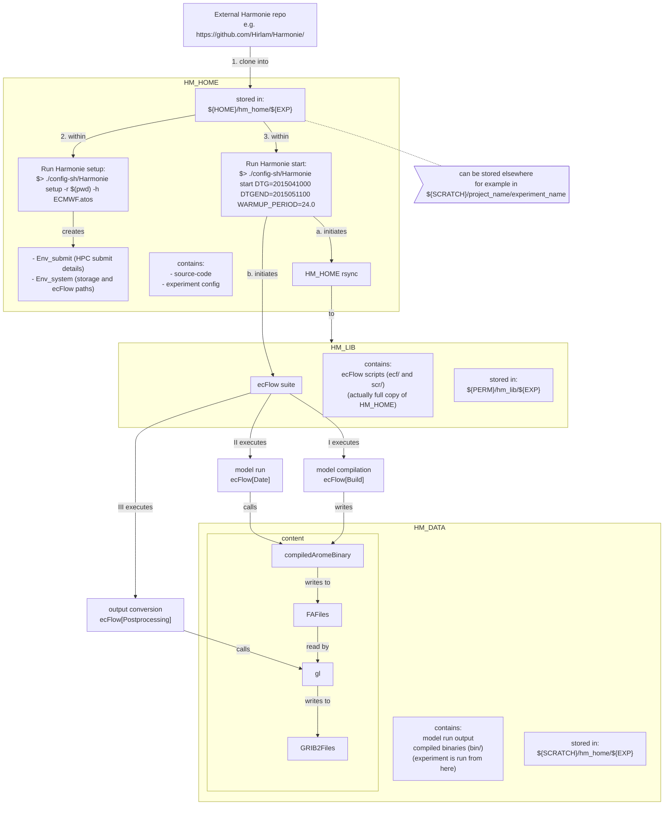

```mermaid
graph TB
harmonieSetup["Run Harmonie setup:\n$> ./config-sh/Harmonie setup -r $(pwd) -h ECMWF.atos"]
harmonieStart["Run Harmonie start:\n$> ./config-sh/Harmonie start DTG=2015041000 DTGEND=2015051100 WARMUP_PERIOD=24.0"]

externalHarmonieRepo["External Harmonie repo\ne.g. https://github.com/Hirlam/Harmonie/"]
externalHarmonieRepo -- 1. clone into --> hm_home_location

harmonieSetupOutput["- Env_submit (HPC submit details)\n- Env_system (storage and ecFlow paths)"]

subgraph ecFlowSuite["ecFlow suite"]
end

subgraph HM_HOME
hm_home_location["stored in:\n${HOME}/hm_home/${EXP}"]
hm_home_content["contains:\n- source-code\n- experiment config"]
harmonieSetupOutput

hm_home_location -- 2. within --> harmonieSetup
harmonieSetup -- creates --> harmonieSetupOutput

harmonieStart -- a. initiates --> hmDatahmLibRsync["HM_HOME rsync"]
end

hm_home_location -.- otherStorage>"can be stored elsewhere\nfor example in\n${SCRATCH}/project_name/experiment_name"]

harmonieStart -- b. initiates --> ecFlowSuite

%% ecFlow steps
modelCompilation["model compilation\necFlow[Build]"]
modelRun["model run\necFlow[Date]"]
outputConversion["output conversion\necFlow[Postprocessing]"]

ecFlowSuite -- I executes --> modelCompilation 
ecFlowSuite -- II executes --> modelRun
ecFlowSuite -- III executes --> outputConversion

modelRun -- calls --> compiledAromeBinary
modelCompilation -- writes --> compiledAromeBinary
outputConversion -- calls --> gl

%% HM_LIB

subgraph HM_LIB
hm_lib_content["contains:\necFlow scripts (ecf/ and scr/)\n(actually full copy of HM_HOME)"]
hm_lib_location["stored in:\n${PERM}/hm_lib/${EXP}"]

ecFlowSuite

end

compiledAromeBinary -- writes to --> FAFiles
FAFiles -- read by --> gl
gl -- writes to --> GRIB2Files

subgraph HM_DATA
hm_data_content["contains:\nmodel run output\ncompiled binaries (bin/)\n(experiment is run from here)"]
hm_data_location["stored in:\n${SCRATCH}/hm_home/${EXP}"]

subgraph hmDataContent["content"]
FAFiles
GRIB2Files
end

subgraph hmDataContent["content"]
compiledAromeBinary
gl
end
end

hmDatahmLibRsync -- to --> HM_LIB

hm_home_location -- 3. within --> harmonieStart
```